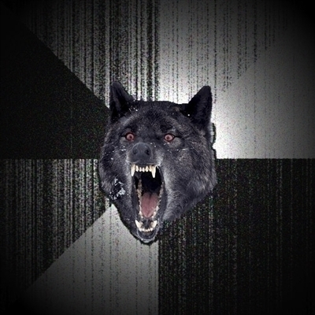

## Experiments with pandoc figures (ˈjuːnɪˌkəʊd!) {#sec:expt .class1 .class2 key=value}

{#fig:attr .class1 .class2 key=value}

Here is a reference to @fig:attr and here is one to @fig:attr2.

Here is reference to the section called @sec:expt.

Here is @eq:silly:

$$
2 + 2 = 5
\label{eq:silly}
$$

## Unnumbered Section {-}

{#fig:nonum -}

## Multiple references {-}

We can refer to multiple things of the same type: [@fig:attr; @fig:attr2]

Or to multiple things of mixed type: [@fig:attr; @fig:attr2;
@sec:expt; @eq:silly]

But if there are any missing keys, nothing will happen: [@fig:attr;
@fig:idontexist]
